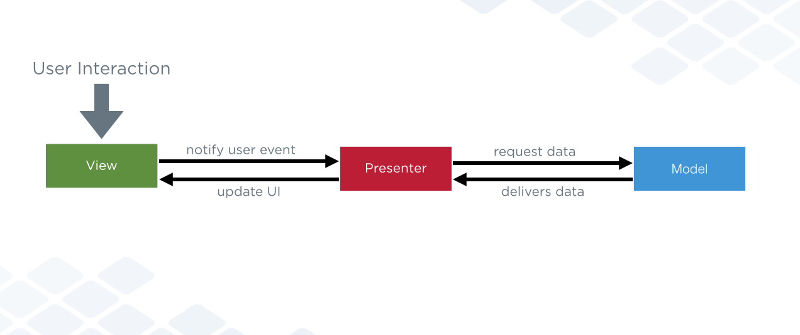
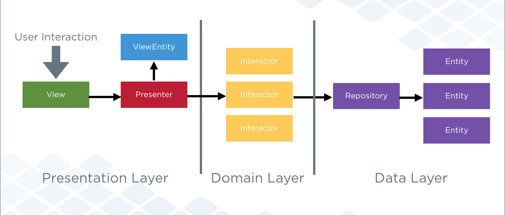

Effective Android
=================
The Android SDK has changed much since its first version. Every new version comes with many new APIs. However, there is no perfect API, some do too much under the hood, others couple your classes to the context, others have more lifecycle events than you have years in your life.

This sample project shows how to apply MVP and Clean architecture on an Android app.
[Demo Video!](https://www.youtube.com/watch?v=siD9Ll_D93s)

A brief explanation of both architectures

MVP
------
The [mvp branch](https://github.com/rallat/EffectiveAndroid/tree/mvp) of this repo follows this architecture:

Clean
--------
The [clean branch](https://github.com/rallat/EffectiveAndroid/tree/clean) of this repo follows this architecture:

